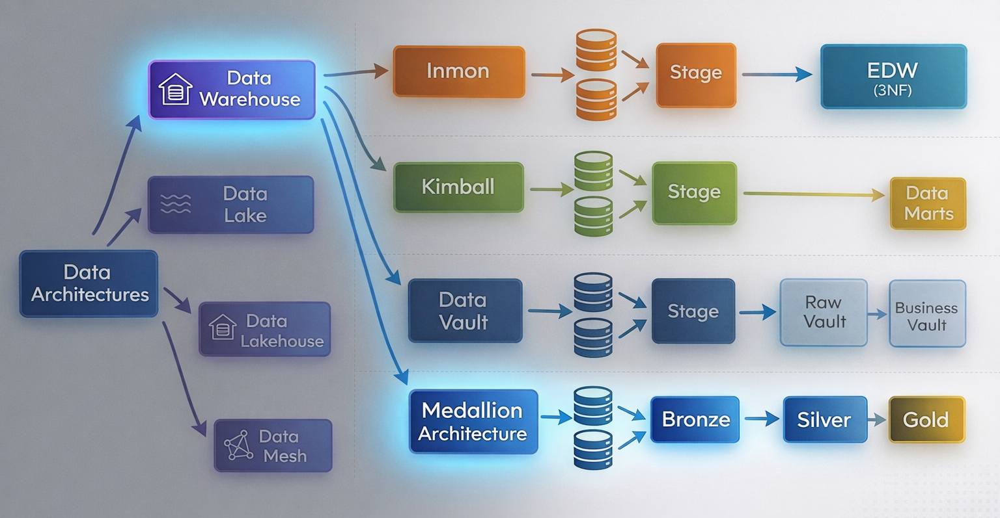
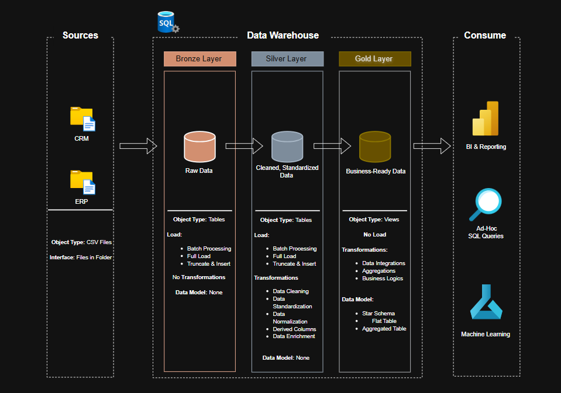

# SQL Data Warehouse Project (Medallion Architecture)

## Quick Links
- 🏗️ [Architecture Overview](#architecture-overview)
- 🥉 [Bronze Layer](#bronze-layer--raw-data-ingestion)
- 🥈 [Silver Layer](#silver-layer--data-cleansing--transformation)
- 🥇 [Gold Layer](#gold-layer--star-schema-analytics-ready)
- 📊 [Star Schema Design](#star-schema-design)
- 🗂️ [Project Structure](#project-structure)
- 📬 [Contact](#contact)

---

## Project Overview

This project implements a complete SQL-based **Data Warehouse solution** using the **Medallion Architecture (Bronze → Silver → Gold)**.

The system:

- Loads raw CRM and ERP datasets from CSV files  
- Performs structured ETL transformations  
- Cleans and standardizes business data  
- Implements a dimensional Star Schema  
- Produces analytics-ready fact and dimension views  

This project demonstrates practical **data engineering, ETL development, and dimensional modeling** using SQL Server.

---

# Architecture Overview

## Project Flow Diagram



---

## Data Architecture Landscape



---

# Business Problem

Organizations often face:

- Disconnected CRM and ERP systems  
- Duplicate customer records  
- Inconsistent product hierarchies  
- Dirty and incomplete data  
- Limited reporting performance  

This project centralizes data into a structured warehouse and applies business rules to enable reliable analytics.

---

# Objectives

- Design a layered Data Warehouse architecture  
- Ingest raw CSV data using BULK INSERT  
- Apply cleansing and deduplication logic  
- Normalize inconsistent source values  
- Implement dimensional modeling  
- Build a Star Schema for analytics  
- Ensure scalable and maintainable ETL pipelines  

---

# Bronze Layer – Raw Data Ingestion

## Purpose

Stores raw, unmodified data exactly as received from source systems.

## Characteristics

- No transformations  
- No constraints  
- Full refresh loading  
- Fast ingestion using BULK INSERT  
- Raw data preservation  

## Bronze Tables

- `bronze.crm_cust_info`  
- `bronze.crm_prd_info`  
- `bronze.crm_sales_details`  
- `bronze.erp_cust_az12`  
- `bronze.erp_loc_a101`  
- `bronze.erp_px_cat_g1v2`  

## Execution

```sql
EXEC bronze.load_bronze;
```

---

# Silver Layer – Data Cleansing & Transformation

## Purpose

Performs ETL logic:

- Data cleansing  
- Deduplication  
- Standardization  
- Business rule enforcement  
- Validation  

## Key Transformations

### Customer Data
- Trim whitespace  
- Normalize marital status  
- Normalize gender  
- Remove duplicates using `ROW_NUMBER()`  

### Product Data
- Extract category ID  
- Normalize product line codes  
- Convert DATETIME to DATE  
- Calculate product end date using `LEAD()`  

### Sales Data
- Convert integer date (YYYYMMDD) to DATE  
- Recalculate sales if incorrect  
- Derive price if missing  
- Prevent divide-by-zero using `NULLIF()`  

### ERP Data
- Remove ID prefixes  
- Nullify future birthdates  
- Normalize country codes  
- Standardize gender values  

## Execution

```sql
EXEC silver.load_silver;
```

---

# Gold Layer – Star Schema (Analytics Ready)

## Purpose

Provides structured dimensional models optimized for analytics and BI tools.

Gold objects are created as **views** for flexibility and maintainability.

---

# Star Schema Design

## Fact Table – `gold.fact_sales`

Contains transactional sales data.

Key fields:

- Order Number  
- Product Key (FK)  
- Customer Key (FK)  
- Order Date  
- Shipping Date  
- Due Date  
- Sales Amount  
- Quantity  
- Price  

---

## Dimension – `gold.dim_customers`

- Surrogate Customer Key  
- Customer ID  
- Customer Name  
- Country  
- Marital Status  
- Gender  
- Birthdate  
- Create Date  

---

## Dimension – `gold.dim_products`

- Surrogate Product Key  
- Product ID  
- Product Name  
- Category & Subcategory  
- Product Line  
- Product Cost  

---

# ETL Process Flow

1. Load raw CSV data into Bronze  
2. Transform and cleanse data into Silver  
3. Generate dimensional views in Gold  
4. Query Gold layer for analytics and BI tools  

---

# Technical Highlights

- Medallion Architecture implementation  
- Window functions (`ROW_NUMBER`, `LEAD`)  
- Surrogate key generation  
- Data validation logic  
- Business rule enforcement  
- TRY-CATCH error handling  
- Batch load performance tracking  

---

# Challenges Faced

- Handling inconsistent source formats  
- Designing robust deduplication logic  
- Converting integer-based date fields  
- Maintaining consistency across layers  
- Structuring scalable transformation logic  

---

# Key Learnings

- Real-world ETL design principles  
- Dimensional modeling best practices  
- Window function optimization  
- Data quality enforcement strategies  
- Structured SQL development for analytics systems  

---

# Project Structure

```text
SQL-DataWarehouse-Project/
│
├── datasets/
│   ├── source_crm/
│   └── source_erp/
│
├── bronze/
│   ├── bronze_ddl.sql
│   └── load_bronze.sql
│
├── silver/
│   ├── silver_ddl.sql
│   └── load_silver.sql
│
├── gold/
│   └── gold_views.sql
│
├── docs/
│   ├── project_overview.png
│   └── data_architecture.png
│
└── README.md
```

---

# Contact

**Name:** Shaikh Mohd Israhil  
**Email:** mohdisrahils@gmail.com  
**LinkedIn:** https://www.linkedin.com/in/mohd-israhil-shaikh-3b8b04281/  
**Portfolio:** https://shaikh-israhil-eqci8dy.gamma.site/  
**GitHub:** https://github.com/israhil10  

---
